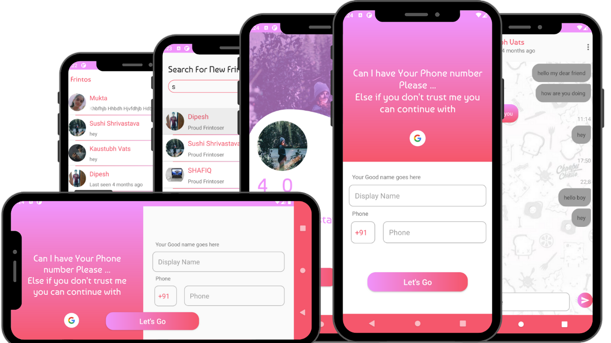

<h3 align="center"> Hello, This is Kaustubh Vats </h3>

  

### 🤝🏻 Social Media

  
  
  
  
  

### 📚 Education

### 🎨 Skills and Technologies

    
    
    
    
    
    
    
    
    
    

 

    
    
    

 

    
    
    
    
    

 

    
    
    
    
    

 

    
    
    
    

 

    
    
    
    

### 🧑🏻‍💻 Projects

&nbsp;&nbsp;

&nbsp;&nbsp;

&nbsp;&nbsp;

### 📈 Statistics
 

 

